# BANK SYSTEM
Java project by Ximena Toledo
# STRUCTURE

# FINAL STRUCTURE
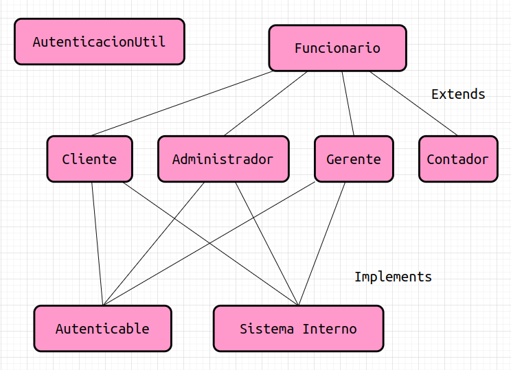
# PILA DE EJECUCIÓN DE JAVA
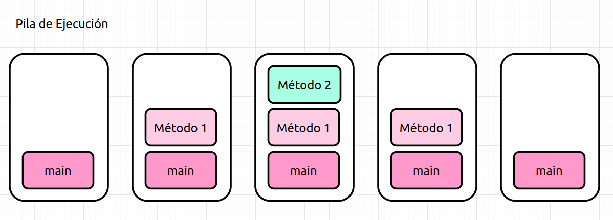
# EXCEPTIONS
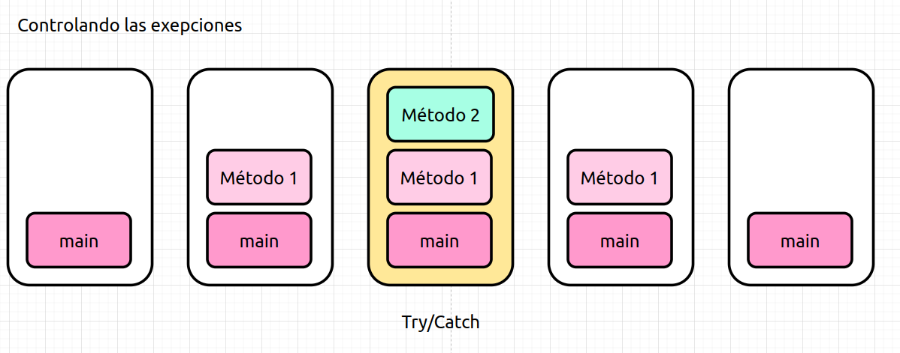
# HEAP
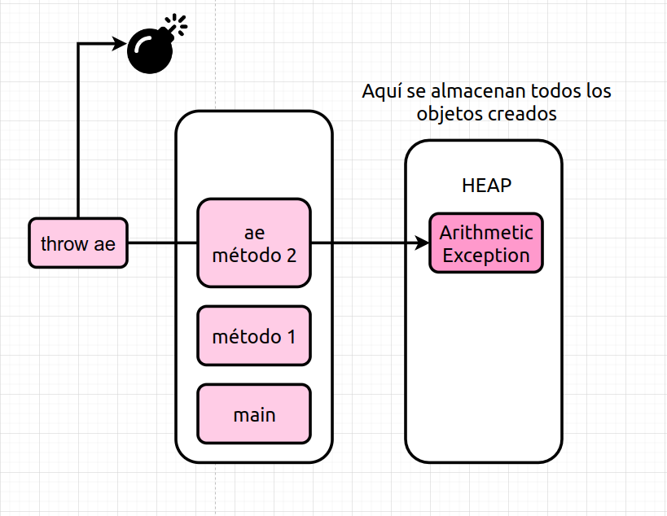
# UNCHECKED AND CHECKED
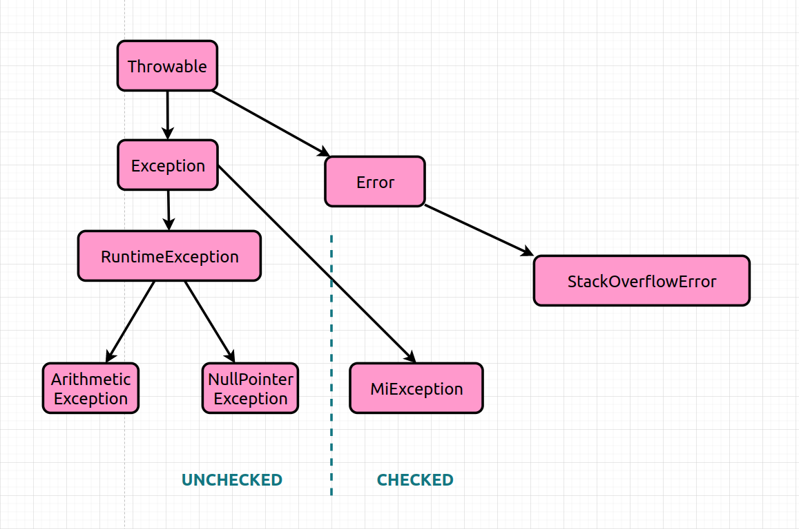
# ARRAYS
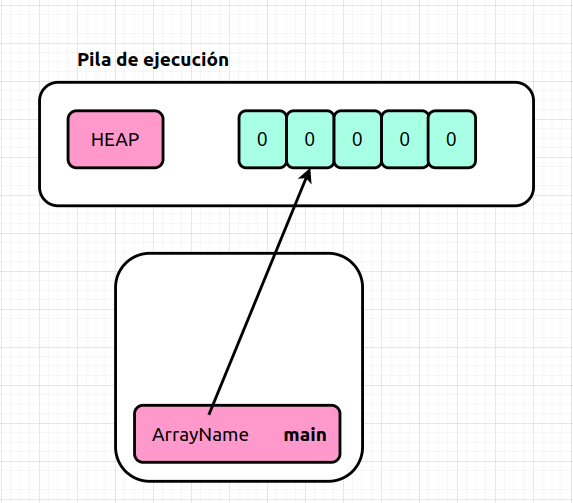
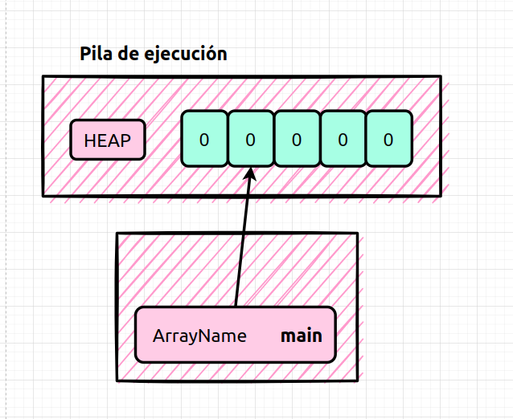
# MODIFICADORES DE ACCESO
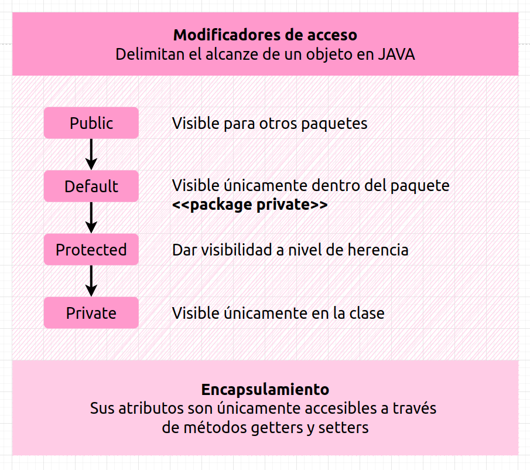

# THREAD SAFE
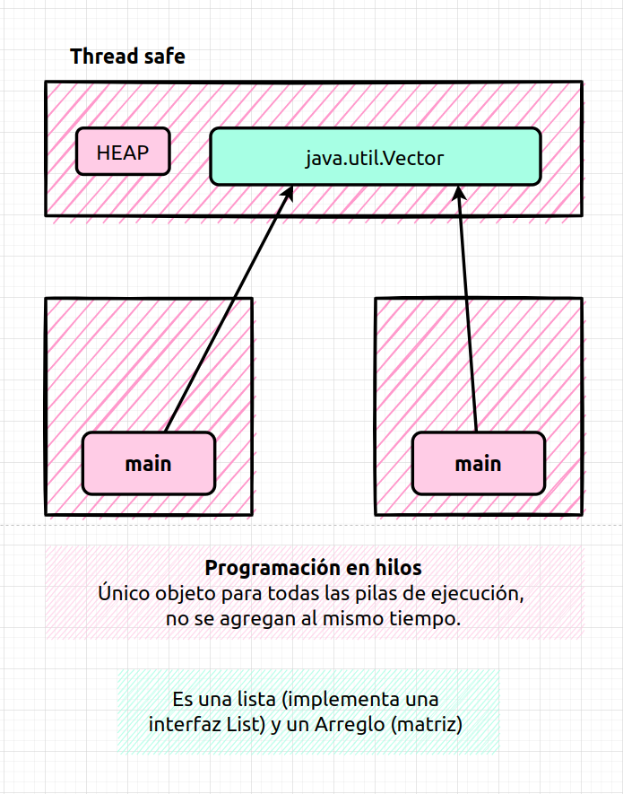

# JAVA UTILITIES
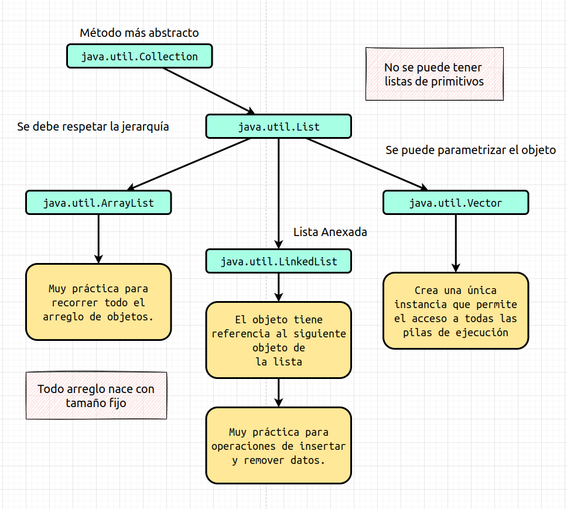

# INTERFACES
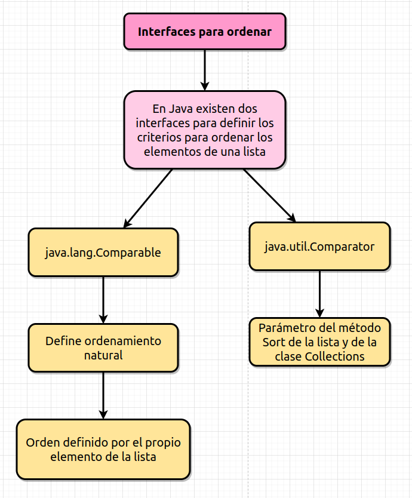

# WRAPPERS
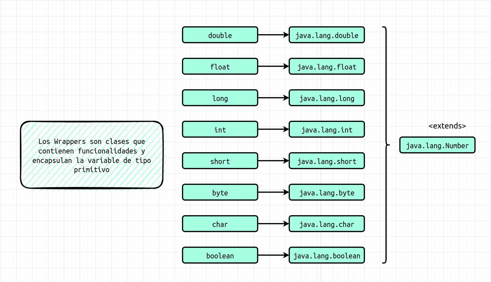
